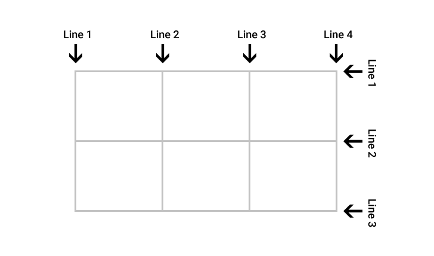
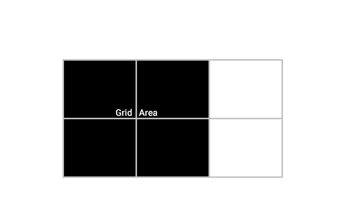

# CSS Grid Layout - Manual

> OBS: Este manual utiliza a versão da [especificação publicada como Working Draft em 17 de março de 2015.](http://www.w3.org/TR/css-grid-1/)

## Índice

- [Intrudução](#introducao)
- [Termonilogia](#termonilogia)
  - [Grid Lines](#grid-lines)
  - [Grid Tracks](#grid-tracks)
  - [Grid Cells](#grid-cells)
  - [Grid Areas](#grid-areas)
- [Grid Container](#grid-container)
- Line-Based placement
- Line-Based positioning
- fr
- Nomeando as areas
- Support

### Intrudução

Um novo modulo CSS3 que define um grid nativo otimizado para construção de interfaces.

### Termonilogia

Nesta seção aprenderemos quais são os novos termos que vem junto com a especificação, esses termos serão muito importantes para entendermos melhor como funciona o grid layout.

#### Grid Lines



**Definição:** É a linha que existe em ambos os lados de uma row ou column.

Elas podem ser referenciadas pelo índice numérico, ou por um nome especificado que pode ser definido pelo desenvolvedor.

**OBS:** Um Grid Item faz referência as Grid Lines para determinar sua posição usando as propriedades grid-placement.

#### Grid Tracks


**Definição:** Por definição é o termo generico para uma grid Column ou grid Row. Podemos pensar em uma Grid Track como o espaço entre duas Grid Lines adjacentes.

#### Grid Cells


**Definição:** O espaço entre duas Grid Rows e duas Grid Column adjacentes.

#### Grid Areas



**Definição:** Um espoço contendo um ou mais Grid Items.

### Grid Container
Um novo valor para a propriedade display :)

#### grid
Cria um elemento que se comporta como `block` e transforma seus elementos filhos em `Grid Items`.

```css
.container {
  display: grid;
}
```
#### inline-grid
Cria um elemento que se comporta como `inline-block` e transforma seus elementos filhos em `Grid Items`.

```css
.container {
  display: inline-grid;
}
```

### Line-Based placement
*Em breve*

### Line-Based positioning
*Em breve*

### fr
*Em breve*

### Nomeando as areas
*Em breve*

### Support
*Em breve*

## Referências
- [Learning CSS Grid Layout](https://github.com/afonsopacifer/learning-css-grid-layout)

## Licença
[MIT License](license.md) © [Afonso Pacifer](http://afonsopacifer.com/)
